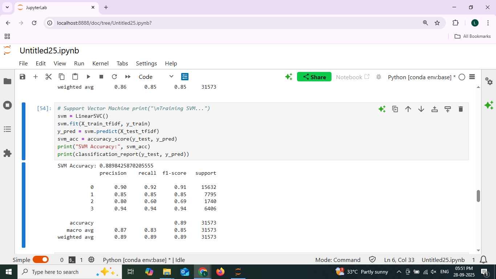
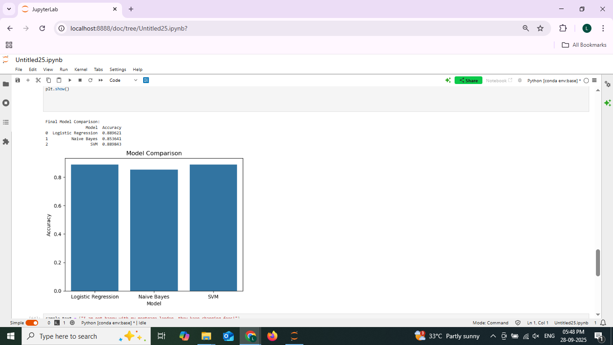

# Task 5: Consumer Complaint Text Classification

**Author:** Leena Sree S
**Date:** 28.09.2025 

## Overview

This project performs **text classification** on the [Consumer Complaint Dataset](https://catalog.data.gov/dataset/consumer-complaint-database) to classify complaints into four categories:

| Label | Category |
|-------|----------|
| 0     | Credit reporting, repair, or other |
| 1     | Debt collection |
| 2     | Consumer Loan |
| 3     | Mortgage |

The project includes the following steps:

1. Explanatory Data Analysis and Feature Engineering  
2. Text Preprocessing  
3. Training Multiple Classification Models (Logistic Regression, Naive Bayes, SVM)  
4. Comparing Model Performance  
5. Model Evaluation  
6. Making Predictions  

---

## 1. Explanatory Data Analysis (EDA)

- **Dataset Size:** (157865, 20) 
- **Number of Classes:** 4  
- **Distribution of Classes:** 
Counts of each category:
0 (Credit reporting, repair, or other): 78095
1 (Debt collection): 38741
2 (Consumer Loan): 9029
3 (Mortgage): 32000 

---

## 2. Feature Engineering & Text Preprocessing

- Removed null values  
- Cleaned text (lowercasing, removing punctuation, numbers, links)  
- Converted text into **TF-IDF vectors** (max 5000 features)  

  

---

## 3. Model Training

### Logistic Regression

- Trained using `LogisticRegression(max_iter=200)`  
- Accuracy: 0.889621  

  

### Naive Bayes

- Trained using `MultinomialNB()`  
- Accuracy: 0.853641 

  

### Support Vector Machine (SVM)

- Trained using `LinearSVC()`  
- Accuracy: 0.889843 

  

---

## 4. Model Comparison

| Model               | Accuracy |
|--------------------|----------|
| Logistic Regression | 0.889621 |
| Naive Bayes         | 0.853641 |
| SVM                 | 0.889843 |

  

Observations:  
- Among the models trained, **SVM (Support Vector Machine)** performed the best in terms of accuracy and overall classification metrics.  
- Logistic Regression and Naive Bayes also gave reasonable results, but SVM was more consistent across all four complaint categories.  
- SVM’s ability to handle high-dimensional TF-IDF features likely helped it capture subtle differences in the complaint texts, resulting in better predictions.
 

---

## 5. Example Prediction

- Sample complaint text: `"I am not happy with my mortgage lender, they keep charging fees!"`  
- Predicted category: `Mortgage`  

  

---
